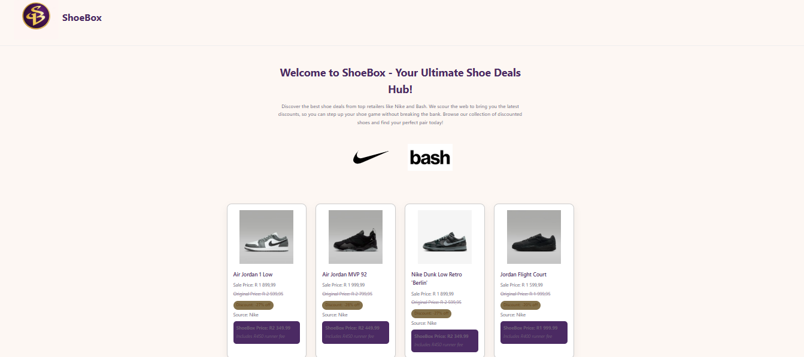
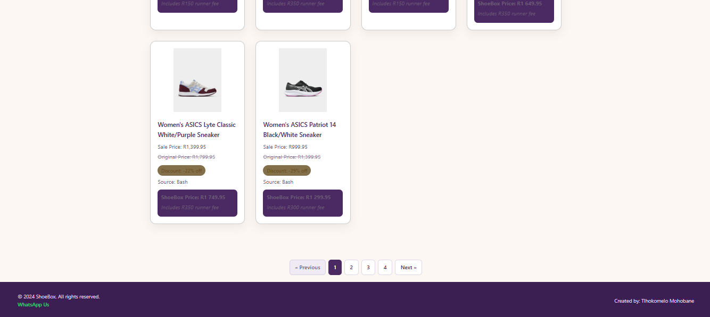

# ShoeBox — Dropshipping Product Discovery Platform

A Python-based web scraping and dashboard application that aggregates discounted shoe deals from major retailers, built to give local dropshippers a competitive edge in their market.

---

## The Problem

Local dropshippers in Lesotho traditionally rely on a tedious, manual product research process — browsing retailer websites, taking screenshots of sale items, and posting them individually to their social media platforms. This approach is time-consuming, inconsistent, and makes it difficult to compete with established second-hand clothing sellers and factory-reject vendors who already have streamlined supply chains.

ShoeBox was built to solve this. Instead of manually hunting for deals, dropshippers and their customers get instant access to a centralized, always-current feed of quality shoes on sale from top retailers — giving them a real competitive edge.

---

## How It Works for Users

ShoeBox puts the product discovery process on autopilot:

1. **Browse** — Customers visit the ShoeBox dashboard and scroll through discounted shoes aggregated from Nike and Bash.com.
2. **Choose** — When a customer finds a shoe they're interested in, they click through directly to the product's official retailer page to view full details (sizes, colors, availability).
3. **Order** — From there, either:
   - The customer places the order directly and the dropshipper handles delivery, **or**
   - The customer shares the shoe's details (size, color, etc.) with the dropshipper, who then handles both the purchase and delivery on their behalf.

This removes the back-and-forth of manual product sharing and gives customers a professional, browsable storefront rather than a stream of screenshots.

---

## Screenshots

**Header**


**Footer**


## Features

- **Multi-Source Scraping**: Automatically pulls discounted shoes from Nike (ZA) and Bash.com
- **Centralized Dashboard**: Clean, browsable Flask web interface — no social media scrolling required
- **Direct Retailer Links**: Every product links directly to its official page for accurate sizing and stock info
- **Discount Visibility**: Displays sale price, original price, and percentage off at a glance
- **ShoeBox Pricing**: Each product displays a ShoeBox Price (retailer sale price + runner fee) so customers know the full cost upfront
- **Pagination**: Browse 30 products per page with smooth navigation
- **Source Attribution**: Each product is labeled by its retailer

---

## Tech Stack

| Layer             | Technology               |
| ----------------- | ------------------------ |
| Language          | Python 3                 |
| Web Framework     | Flask                    |
| Scraping          | BeautifulSoup4, Requests |
| Data Handling     | Pandas                   |
| Templating        | Jinja2                   |
| Production Server | Gunicorn                 |
| Parser            | LXML                     |

---

## Installation

### Prerequisites

- Python 3.7+
- pip
- Virtual environment (recommended)

### Setup

1. **Clone the repository**

   ```bash
   cd Dropshipping_Scrapper
   ```

2. **Create and activate a virtual environment**

   ```bash
   python -m venv venv
   # Windows:
   venv\Scripts\activate
   # macOS/Linux:
   source venv/bin/activate
   ```

3. **Install dependencies**
   ```bash
   pip install -r requirements.txt
   ```

---

## Usage

### Step 1 — Run the Scrapers

```bash
python scrapers/nike_scraper.py
python scrapers/bash_scraper.py
```

### Step 2 — Combine and Process the Data

```bash
python combineScrappedInfo.py
```

This merges both scraper outputs into a single `shoes.csv` file and runs the ETL process — normalizing prices and calculating runner fees and ShoeBox prices for every item.

### Step 3 — Launch the Dashboard

```bash
python app.py
```

Then open your browser and go to:

```
http://localhost:5000
```

---

## Project Structure

```
Dropshipping_Scrapper/
├── app.py                      # Flask web application
├── combineScrappedInfo.py      # Data aggregation and ETL script
├── requirements.txt            # Python dependencies
├── Procfile                    # Deployment configuration
├── README.md                   # This file
├── shoes.csv                   # Combined and processed data (generated)
├── scrapers/
│   ├── nike_scraper.py        # Nike ZA scraper
│   ├── bash_scraper.py        # Bash.com scraper
│   ├── nike_shoes.csv         # Nike output
│   └── bash_shoes.csv         # Bash output
├── templates/
│   └── index.html             # Dashboard HTML template
└── static/
    ├── styles.css             # Stylesheet
    └── images/                # Logo and static assets
```

---

## How It Works

### Data Pipeline

1. **Web Scraping**: Individual scrapers extract product data from retailer websites
   - Requests HTML from the target URL
   - BeautifulSoup parses the HTML to find product information
   - Data is saved to a CSV per retailer

2. **ETL — Data Aggregation and Processing**: `combineScrappedInfo.py`
   - Merges both CSVs into a single DataFrame
   - Normalizes the two different SA price formats used by Nike and Bash into clean floats
   - Calculates a runner fee and ShoeBox price for every item
   - Saves the fully processed data to `shoes.csv`

3. **Web Display**: Flask application
   - Reads the processed CSV on each page request
   - Applies pagination (30 items per page)
   - Identifies product source (Nike or Bash)
   - Renders the data using the HTML template

---

## Runner Fee Structure

Each product on ShoeBox displays a **ShoeBox Price** alongside the retailer's sale price. This ShoeBox Price includes a runner fee that covers the dropshipper's service and delivery handling.

### Fee Tiers

| Order Amount (R) | Runner Fee        |
| ---------------- | ----------------- |
| R0 – R100        | R60               |
| R101 – R200      | R100              |
| R201 – R300      | R130              |
| R301 – R500      | R150              |
| R501 – R700      | R200              |
| R701 – R900      | R250              |
| R901 – R1,100    | R300              |
| R1,101 – R1,400  | R350              |
| R1,401 – R1,700  | R400              |
| R1,701 – R2,000  | R450              |
| R2,001 – R2,300  | R500              |
| R2,301 – R2,700  | R550              |
| R2,701 – R3,000  | R600              |
| R3,001 – R3,400  | R650              |
| R3,401 – R3,700  | R700              |
| R3,701 – R4,000  | R750              |
| R4,001 and above | 30% of sale price |

### How it's calculated

In `combineScrappedInfo.py`, the `parse_price()` function handles both South African price formats used by Nike and Bash (they differ in how they use commas and periods). The `calculate_runner_fee()` function then applies the correct tier and writes `runner_fee` and `shoebox_price` as new columns into `shoes.csv`. This means `app.py` simply reads those values from the CSV — no price logic lives in the web layer.

### Design rationale

A tiered flat fee was chosen over a straight percentage for most of the price range because:

- It's transparent — customers can see exactly what the runner fee is before clicking through
- It scales gradually so budget items remain accessible while higher-value items still generate a worthwhile margin
- For items above R4,000 a 30% rate is applied instead, since a flat fee at that price point would undercut the dropshipper's effort and risk on premium orders

---

## Future Enhancements

- Add more South African retailer sources using Selenium
- Replace CSV storage with a database (PostgreSQL or SQLite)
- Add search, filter, and sort functionality
- Automate daily scraping on a schedule
- Display price history and trend graphs
- Add a customer wishlist / saved items feature

---

## Notes on Web Scraping

- Always respect a website's `robots.txt` and Terms of Service
- Use descriptive `User-Agent` headers to identify your scraper
- Implement rate limiting to avoid overloading servers

---

## Author

Tlhokomelo Thomas Mohobane
